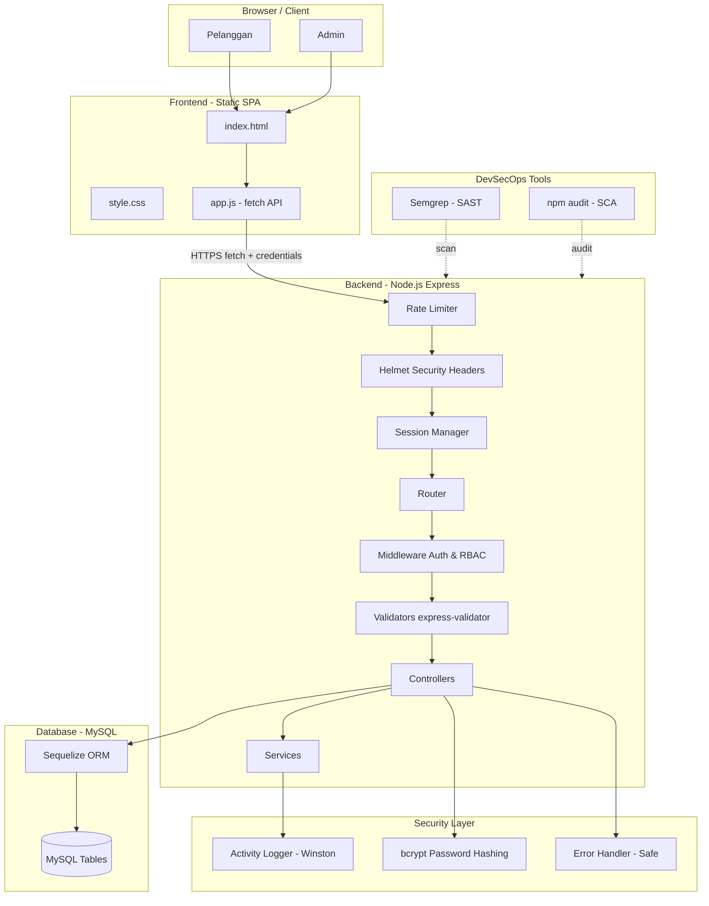
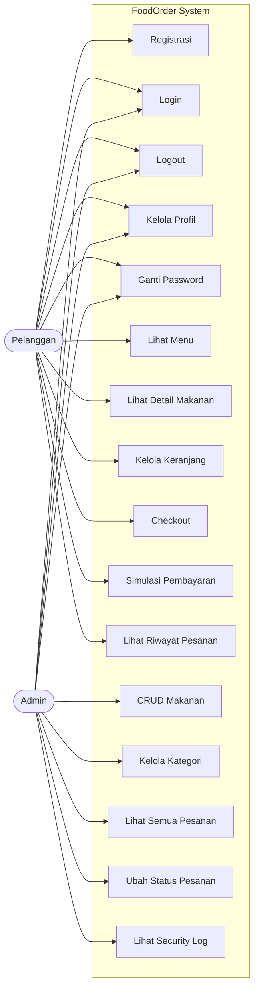
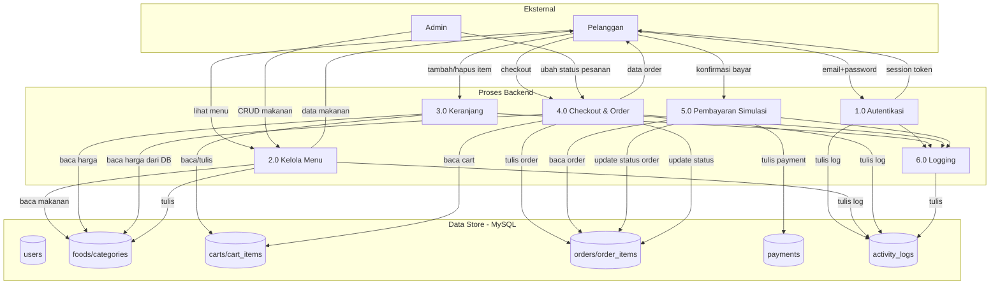
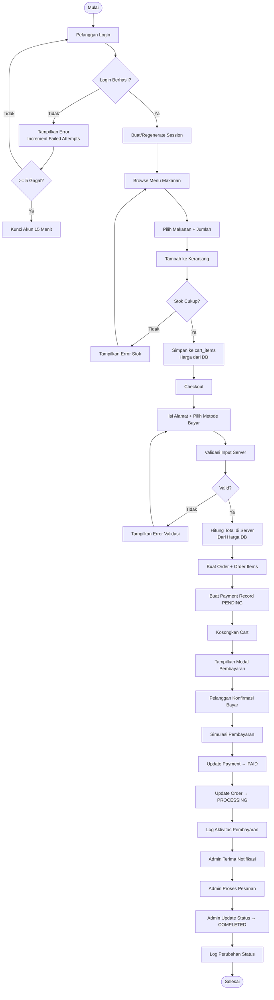

# FoodOrder — Sistem Pemesanan Makanan
> Tugas UTS Secure Software Development Lifecycle (DEVSECOPS)

---

## Daftar Isi
1. [Deskripsi Aplikasi](#1-deskripsi-aplikasi)
2. [Teknologi](#2-teknologi)
3. [Struktur Folder](#3-struktur-folder)
4. [Cara Instalasi & Menjalankan](#4-cara-instalasi--menjalankan)
5. [Akun Default](#5-akun-default)
6. [Fitur Aplikasi](#6-fitur-aplikasi)
7. [Desain Database & ERD](#7-desain-database--erd)
8. [Arsitektur Aplikasi](#8-arsitektur-aplikasi)
9. [Use Case Diagram](#9-use-case-diagram)
10. [Data Flow Diagram](#10-data-flow-diagram)
11. [Flowchart Proses Pemesanan](#11-flowchart-proses-pemesanan)
12. [Threat Modeling (STRIDE)](#12-threat-modeling-stride)
13. [Analisis OWASP Top 10](#13-analisis-owasp-top-10)
14. [Secure Coding — Contoh Implementasi](#14-secure-coding--contoh-implementasi)
15. [SAST — Semgrep](#15-sast--semgrep)
16. [SCA — npm audit](#16-sca--npm-audit)
17. [Laporan Tugas](#17-laporan-tugas)

---

## 1. Deskripsi Aplikasi

**FoodOrder** adalah aplikasi web sistem pemesanan makanan yang dikembangkan dengan pendekatan **Secure by Design** mengacu pada prinsip **SSDLC (Secure Software Development Lifecycle)**. Aplikasi ini memungkinkan pelanggan untuk memesan makanan secara online dan administrator untuk mengelola menu serta pesanan.

---

## 2. Teknologi

| Komponen | Teknologi |
|---|---|
| Frontend | HTML5, CSS3, JavaScript (Vanilla SPA) |
| Backend | Node.js + Express.js |
| Database | MySQL |
| ORM | Sequelize (prepared statement otomatis) |
| Authentication | Session-based (express-session) |
| Password Hashing | bcrypt (cost factor 12) |
| Validasi Input | express-validator |
| Security Headers | helmet |
| Rate Limiting | express-rate-limit |
| Logging | winston |
| SAST | Semgrep |
| SCA | npm audit |
| Environment | dotenv |

---

## 3. Struktur Folder

```
foodorder/
├── .env                        # Environment variables (JANGAN commit)
├── .env.example                # Template .env
├── .gitignore
├── .semgrep/
│   └── rules.yml               # Aturan SAST Semgrep
├── package.json
├── server.js                   # Entry point — konfigurasi Express + security
│
├── config/
│   ├── database.js             # Koneksi Sequelize ke MySQL
│   └── constants.js            # Konstanta global (roles, status, dll)
│
├── controllers/                # Business logic tiap fitur
│   ├── authController.js       # Register, login, logout, profil
│   ├── foodController.js       # CRUD makanan
│   ├── categoryController.js   # CRUD kategori
│   ├── cartController.js       # Keranjang belanja
│   ├── orderController.js      # Pemesanan, pembayaran, riwayat
│   └── logController.js        # Security logs (admin)
│
├── middleware/
│   ├── auth.js                 # authenticate(), authorize(), adminOnly()
│   ├── validate.js             # Handler hasil express-validator
│   └── errorHandler.js         # Global error handler (no info leakage)
│
├── models/                     # Sequelize models (ORM)
│   ├── index.js                # Definisi semua asosiasi
│   ├── User.js
│   ├── Category.js
│   ├── Food.js
│   ├── Cart.js
│   ├── CartItem.js
│   ├── Order.js
│   ├── OrderItem.js
│   ├── Payment.js
│   └── ActivityLog.js
│
├── routes/
│   ├── auth.js                 # /api/auth/*
│   └── api.js                  # /api/* (foods, cart, orders, admin)
│
├── services/
│   └── activityLogService.js   # Catat security log ke DB + file
│
├── validators/
│   ├── authValidator.js        # Aturan validasi auth
│   └── foodValidator.js        # Aturan validasi food/cart/order
│
├── utils/
│   ├── logger.js               # Winston logger
│   └── response.js             # Helper response API konsisten
│
├── database/
│   ├── migrate.js              # Sync/migrasi tabel
│   └── seed.js                 # Data awal (admin, kategori, makanan)
│
├── public/                     # File statis (frontend SPA)
│   ├── index.html              # Satu halaman HTML (SPA)
│   ├── css/style.css
│   └── js/app.js               # Frontend JavaScript
│
└── logs/                       # File log (otomatis dibuat)
    ├── combined.log
    ├── error.log
    └── security.log
```

---

## 4. Cara Instalasi & Menjalankan

### Prasyarat
- Node.js >= 18
- MySQL 8.x (atau Docker)

### Langkah Instalasi

```bash
# 1. Clone atau masuk ke folder project
cd foodorder

# 2. Install dependencies
npm install

# 3. Salin file .env dan sesuaikan
copy .env.example .env
# Edit .env — isi DB_PASSWORD, SESSION_SECRET, dsb

# 4. Buat database di MySQL
# Buka MySQL client, jalankan:
CREATE DATABASE foodorder_db CHARACTER SET utf8mb4 COLLATE utf8mb4_unicode_ci;

# 5. Jalankan migrasi (buat tabel)
npm run migrate

# 6. Jalankan seeder (data awal)
npm run seed

# 7. Jalankan server
npm run dev        # development (nodemon)
npm start          # production
```

### Menggunakan Docker untuk MySQL
```bash
docker run -d \
  --name foodorder-mysql \
  -e MYSQL_ROOT_PASSWORD=rootpassword \
  -e MYSQL_DATABASE=foodorder_db \
  -p 3306:3306 \
  mysql:8.0
```
Kemudian set `.env`: `DB_PASSWORD=rootpassword`

---

## 5. Akun Default

| Role | Email | Password |
|---|---|---|
| Admin | admin@foodorder.com | Admin@12345! |
| Customer | pelanggan@foodorder.com | Customer@12345! |

> **Ganti password default segera setelah instalasi di lingkungan production.**

---

## 6. Fitur Aplikasi

### Pelanggan
- Registrasi akun baru
- Login / Logout dengan session aman
- Melihat daftar menu makanan (filter kategori, pencarian)
- Melihat detail makanan
- Menambahkan makanan ke keranjang
- Update/hapus item di keranjang
- Checkout dengan alamat pengiriman
- Simulasi pembayaran
- Melihat riwayat pesanan milik sendiri
- Kelola profil & ganti password

### Administrator
- Login ke dashboard admin
- Dashboard statistik (total order, pending, diproses, total makanan)
- CRUD makanan (tambah, edit, nonaktifkan)
- Kelola kategori
- Melihat semua pesanan
- Mengubah status pesanan (state machine: pending → processing → completed)
- Melihat security activity log

---

## 7. Desain Database & ERD

### Deskripsi Tabel

| Tabel | Deskripsi |
|---|---|
| `users` | Data pengguna (admin & customer), password di-hash bcrypt |
| `categories` | Kategori makanan |
| `foods` | Data menu makanan dengan stok dan harga |
| `carts` | Keranjang belanja (1 user = 1 cart) |
| `cart_items` | Item dalam keranjang, menyimpan snapshot harga saat ditambahkan |
| `orders` | Pesanan yang dibuat saat checkout |
| `order_items` | Item dalam pesanan, menyimpan snapshot nama dan harga makanan |
| `payments` | Rekord pembayaran per pesanan |
| `activity_logs` | Log keamanan: login, akses ditolak, perubahan data penting |

### ERD (Mermaid)

```mermaid
erDiagram
    users {
        int id PK
        varchar name
        varchar email UK
        varchar password
        enum role
        varchar phone
        text address
        boolean is_active
        datetime last_login
        int failed_login_attempts
        datetime locked_until
        datetime created_at
        datetime updated_at
    }

    categories {
        int id PK
        varchar name UK
        text description
        boolean is_active
        datetime created_at
        datetime updated_at
    }

    foods {
        int id PK
        int category_id FK
        varchar name
        text description
        decimal price
        int stock
        varchar image_url
        boolean is_available
        datetime created_at
        datetime updated_at
    }

    carts {
        int id PK
        int user_id FK UK
        datetime created_at
        datetime updated_at
    }

    cart_items {
        int id PK
        int cart_id FK
        int food_id FK
        int quantity
        decimal price_at_add
        datetime created_at
        datetime updated_at
    }

    orders {
        int id PK
        varchar order_number UK
        int user_id FK
        enum status
        decimal total_amount
        text delivery_address
        text notes
        datetime created_at
        datetime updated_at
    }

    order_items {
        int id PK
        int order_id FK
        int food_id FK
        varchar food_name
        int quantity
        decimal unit_price
        decimal subtotal
        datetime created_at
        datetime updated_at
    }

    payments {
        int id PK
        int order_id FK UK
        enum payment_method
        decimal amount
        enum status
        varchar transaction_ref UK
        datetime paid_at
        datetime created_at
        datetime updated_at
    }

    activity_logs {
        int id PK
        int user_id FK
        varchar activity_type
        text description
        varchar ip_address
        text user_agent
        json metadata
        datetime created_at
    }

    users ||--o{ orders : "membuat"
    users ||--o| carts : "memiliki"
    users ||--o{ activity_logs : "menghasilkan"
    categories ||--o{ foods : "memiliki"
    carts ||--o{ cart_items : "berisi"
    foods ||--o{ cart_items : "dimasukkan ke"
    orders ||--o{ order_items : "berisi"
    foods ||--o{ order_items : "termasuk dalam"
    orders ||--o| payments : "dibayar dengan"
```

---

## 8. Arsitektur Aplikasi



---

## 9. Use Case Diagram



---

## 10. Data Flow Diagram



---

## 11. Flowchart Proses Pemesanan



---

## 12. Threat Modeling (STRIDE)

### Identifikasi Aset
| No | Aset | Nilai |
|---|---|---|
| 1 | Data kredensial pengguna (email + password hash) | Sangat Tinggi |
| 2 | Session token | Sangat Tinggi |
| 3 | Data pesanan dan pembayaran | Tinggi |
| 4 | Data menu dan harga makanan | Sedang |
| 5 | Security logs | Tinggi |
| 6 | Source code aplikasi | Tinggi |
| 7 | Koneksi database | Sangat Tinggi |

### Identifikasi Aktor
| Aktor | Tipe | Kepercayaan |
|---|---|---|
| Pelanggan terdaftar | Internal | Rendah-Sedang |
| Admin | Internal | Tinggi |
| Pengguna anonim | Eksternal | Sangat Rendah |
| Penyerang | Eksternal | Tidak Dipercaya |

### Entry Point
- Form login (`POST /api/auth/login`)
- Form registrasi (`POST /api/auth/register`)
- Endpoint keranjang dan order
- Parameter URL (`/foods/:id`, `/orders/:id`)
- Header HTTP (cookie session)
- Input form makanan, alamat, catatan

### Trust Boundary
- Browser ↔ Web Server (HTTPS)
- Web Server ↔ Database (koneksi lokal/internal)
- Pengguna anonim ↔ Pengguna terautentikasi
- Pelanggan ↔ Admin (RBAC)

### Tabel Threat Modeling

| ID | Aset/Komponen | Ancaman | Kategori STRIDE | Dampak | Tingkat Risiko | Mitigasi |
|---|---|---|---|---|---|---|
| TM-01 | Form Login | Brute Force Login | Spoofing | Akun diambil alih, data bocor | **Tinggi** | Rate limiting (5x/15 mnt), lockout akun, logging gagal login |
| TM-02 | Session Cookie | Session Hijacking | Spoofing | Akun diambil alih | **Tinggi** | httpOnly, secure, sameSite=lax, session regeneration saat login |
| TM-03 | Input Form | SQL Injection | Tampering | Akses/manipulasi seluruh DB | **Kritis** | Sequelize ORM (prepared statement otomatis), validasi input |
| TM-04 | Input Form/URL | Cross-Site Scripting (XSS) | Tampering | Pencurian session, defacement | **Tinggi** | escapeHtml() di frontend, helmet CSP, textContent > innerHTML |
| TM-05 | Order API | Manipulasi Harga Makanan | Tampering | Kerugian finansial bisnis | **Kritis** | Harga selalu diambil dari DB server saat checkout, bukan dari client |
| TM-06 | Order/Payment API | Manipulasi Total Pembayaran | Tampering | Kerugian finansial | **Kritis** | Total dihitung server-side, payment amount = order total_amount |
| TM-07 | Order Status API | Manipulasi Status Pesanan | Tampering | Pesanan tidak valid diselesaikan | **Tinggi** | State machine validasi transisi status, hanya admin yang bisa ubah |
| TM-08 | Endpoint `/orders/:id` | IDOR — Akses Data Pesanan Pengguna Lain | Elevation of Privilege | Kebocoran data pribadi | **Tinggi** | Setiap query order difilter `WHERE user_id = session.userId` |
| TM-09 | Admin Endpoint | Akses Admin Tanpa Hak | Elevation of Privilege | Kebocoran data, manipulasi sistem | **Kritis** | Middleware adminOnly() pada semua route admin |
| TM-10 | Form Registrasi | Registrasi dengan Role Admin | Elevation of Privilege | Hak akses tidak sah | **Kritis** | Role selalu diset `customer` di server, tidak bisa dari input client |
| TM-11 | Koneksi DB | Pencurian Kredensial DB | Information Disclosure | Akses penuh ke database | **Kritis** | Simpan di .env, tidak di-hardcode, .env di .gitignore |
| TM-12 | Error Response | Information Disclosure via Error | Information Disclosure | Ekspos stack trace/internal info | **Sedang** | Global error handler generik, detail hanya di log server |
| TM-13 | Login Endpoint | Credential Stuffing / Account Takeover | Spoofing | Banyak akun diambil alih | **Tinggi** | Rate limiting login, lockout, pesan error generik (tidak beda email/password) |
| TM-14 | Payment Endpoint | Double Payment / Replay Attack | Tampering | Pembayaran ganda pada order sama | **Tinggi** | Cek status payment sebelum proses, unique constraint transaction_ref |
| TM-15 | Log System | Penghapusan/Manipulasi Log | Repudiation | Aktivitas jahat tidak terlacak | **Sedang** | Log ditulis ke file (winston) + DB, akses log hanya admin |

---

## 13. Analisis OWASP Top 10

| ID | Bagian Aplikasi | Kerentanan | Kategori OWASP | Penyebab | Dampak | Severity | Mitigasi |
|---|---|---|---|---|---|---|---|
| OW-01 | Semua endpoint | Broken Access Control | A01:2021 | Tidak ada middleware auth/otorisasi | Akses data pengguna lain, akses admin ilegal | **Kritis** | Middleware `authenticate()`, `adminOnly()`, IDOR check `WHERE user_id = session.userId` |
| OW-02 | Penyimpanan password, session | Cryptographic Failures | A02:2021 | Password plaintext, session tidak aman | Kebocoran password, session hijacking | **Kritis** | bcrypt cost factor 12, httpOnly/secure cookie, SESSION_SECRET dari .env |
| OW-03 | Input form, parameter URL | Injection (SQL, XSS) | A03:2021 | Konkatenasi string SQL, innerHTML tanpa sanitasi | Manipulasi DB, pencurian session | **Kritis** | Sequelize ORM, express-validator, escapeHtml() di frontend, helmet CSP |
| OW-04 | Form login/registrasi | Identification & Auth Failures | A07:2021 | Brute force tidak dibatasi, session tidak diregenerasi | Account takeover | **Tinggi** | Rate limiting, lockout akun, session regeneration, password policy |
| OW-05 | Konfigurasi server | Security Misconfiguration | A05:2021 | Header keamanan tidak ada, info server terekspos | Serangan mudah dilakukan, info leakage | **Sedang** | helmet (X-Frame-Options, CSP, HSTS, dll), error handler generik |
| OW-06 | Proses harga & total | Insecure Design | A04:2021 | Total dihitung di client, bukan server | Manipulasi harga/total bayar | **Kritis** | Harga & total selalu dihitung server-side dari database |
| OW-07 | Dependencies | Vulnerable & Outdated Components | A06:2021 | Library pihak ketiga dengan CVE | Eksploitasi kerentanan library | **Sedang** | npm audit secara berkala, update dependency, pin versi |
| OW-08 | Proses order/payment | Software & Data Integrity Failures | A08:2021 | Tidak ada validasi integritas data order | Manipulasi data pesanan | **Tinggi** | Validasi state machine status, snapshot harga di order_items, server-side total |
| OW-09 | Sistem logging | Security Logging & Monitoring Failures | A09:2021 | Aktivitas penting tidak dicatat | Serangan tidak terdeteksi | **Tinggi** | ActivityLog di DB + winston file log untuk: login, logout, akses ditolak, perubahan data |

---

## 14. Secure Coding — Contoh Implementasi

### SC-01: Prepared Statement via Sequelize ORM (mencegah SQL Injection)
```javascript
// ✅ AMAN — Sequelize menggunakan prepared statement secara otomatis
const order = await Order.findOne({
  where: { id: req.params.id, user_id: req.session.userId }
  // Sequelize akan generate: SELECT * FROM orders WHERE id = ? AND user_id = ?
});

// ❌ TIDAK AMAN — jangan lakukan ini
// db.query("SELECT * FROM orders WHERE id = " + req.params.id)
```

### SC-02: Password Hashing dengan bcrypt
```javascript
// models/User.js — Hash otomatis sebelum simpan ke DB
hooks: {
  beforeCreate: async (user) => {
    const rounds = parseInt(process.env.BCRYPT_ROUNDS) || 12;
    user.password = await bcrypt.hash(user.password, rounds); // ✅
  }
}

// Verifikasi — timing-safe compare
User.prototype.verifyPassword = async function (plain) {
  return bcrypt.compare(plain, this.password); // ✅ timing-safe
};
```

### SC-03: Validasi Input dengan express-validator
```javascript
// validators/authValidator.js
body('password')
  .isLength({ min: 8, max: 72 })
  .matches(/^(?=.*[a-z])(?=.*[A-Z])(?=.*\d)(?=.*[@$!%*?&])/)
  .withMessage('Password harus mengandung huruf besar, kecil, angka, dan simbol')

body('email')
  .trim().isEmail().normalizeEmail() // Sanitasi + validasi
```

### SC-04: Role-Based Access Control (RBAC)
```javascript
// middleware/auth.js
const authorize = (...allowedRoles) => {
  return async (req, res, next) => {
    if (!allowedRoles.includes(req.session.userRole)) {
      await logActivity(req, ACTIVITY_TYPES.ACCESS_DENIED, ...);
      return forbidden(res); // 403
    }
    next();
  };
};

// routes/api.js — hanya admin yang bisa akses
router.post('/admin/foods', authenticate, adminOnly, createFoodValidator, validate, foodController.createFood);
```

### SC-05: Pencegahan IDOR (Pemeriksaan Kepemilikan Data)
```javascript
// controllers/orderController.js
const whereClause = { id };
// Customer hanya bisa lihat pesanannya sendiri
if (userRole !== 'admin') {
  whereClause.user_id = userId; // ✅ Filter by owner
}
const order = await Order.findOne({ where: whereClause });
if (!order) return notFound(res); // Tidak tunjukkan bahwa data ada tapi bukan miliknya
```

### SC-06: Harga Dihitung Server-Side (mencegah manipulasi harga)
```javascript
// controllers/orderController.js — checkout
for (const cartItem of cart.items) {
  const food = cartItem.food;
  const unitPrice = parseFloat(food.price); // ✅ Dari database, bukan dari client
  const subtotal  = unitPrice * cartItem.quantity;
  totalAmount    += subtotal;
}
// totalAmount selalu server-calculated, tidak menerima nilai dari request body
```

### SC-07: Secure Session & Cookie
```javascript
// server.js
app.use(session({
  name: 'foodorder.sid',        // Nama tidak mengekspos teknologi
  secret: process.env.SESSION_SECRET, // Dari .env, bukan hardcoded
  resave: false,
  saveUninitialized: false,
  cookie: {
    httpOnly: true,             // ✅ Tidak bisa diakses JavaScript
    secure: NODE_ENV === 'production', // ✅ HTTPS only di production
    sameSite: 'lax',            // ✅ Proteksi CSRF
    maxAge: 24 * 60 * 60 * 1000
  }
}));
// Session regeneration setelah login (mencegah session fixation)
req.session.regenerate((err) => { req.session.userId = user.id; ... });
```

### SC-08: Secure Error Handling (tidak ekspos info internal)
```javascript
// middleware/errorHandler.js
const errorHandler = (err, req, res, next) => {
  logger.error(`Unhandled error: ${err.message}`, { stack: err.stack }); // Log lengkap di server
  return res.status(500).json({
    status: 'error',
    message: 'Terjadi kesalahan pada server' // ✅ Pesan generik ke client
    // Tidak ada: err.stack, err.message, detail internal
  });
};
```

### SC-09: Security Logging
```javascript
// services/activityLogService.js
const logActivity = async (req, activityType, description, metadata = null) => {
  await ActivityLog.create({
    user_id: req.session?.userId,
    activity_type: activityType,  // LOGIN_FAILED, ACCESS_DENIED, dll
    description,
    ip_address: req.ip,
    user_agent: req.headers['user-agent'],
    metadata
  });
  logger.warn(logMessage); // Juga ke file security.log
};
```

### SC-10: Validasi State Machine Status Pesanan
```javascript
// config/constants.js
ORDER_STATUS_TRANSITIONS: {
  pending:    ['processing', 'cancelled'], // ✅ Hanya transisi yang valid
  processing: ['completed', 'cancelled'],
  completed:  [],  // Tidak bisa diubah lagi
  cancelled:  []   // Tidak bisa diubah lagi
}

// controllers/orderController.js
const allowed = ORDER_STATUS_TRANSITIONS[order.status] || [];
if (!allowed.includes(status)) {
  return res.status(400).json({ message: `Tidak dapat mengubah dari "${order.status}" ke "${status}"` });
}
```

---

## 15. SAST — Semgrep

### Instalasi Semgrep
```bash
# Menggunakan pip (Python harus terinstall)
pip install semgrep

# Atau menggunakan Docker
docker run --rm -v "${PWD}:/src" semgrep/semgrep semgrep --config .semgrep/rules.yml /src
```

### Menjalankan Scan
```bash
# Scan dengan rules custom project ini
npm run sast

# Atau manual
semgrep --config .semgrep/rules.yml . --output semgrep-report.json --json

# Scan dengan rules bawaan Semgrep (OWASP, security-audit)
semgrep --config p/nodejs-security-audit .
semgrep --config p/owasp-top-ten .
```

### Rules SAST yang Dikonfigurasi

File: `.semgrep/rules.yml` berisi 10 rules:

| ID | Rule | Mendeteksi | Severity |
|---|---|---|---|
| R001 | hardcoded-secret | Password/token hardcoded | ERROR |
| R002 | sql-injection-string-concat | SQL dari string concat | ERROR |
| R003 | dangerous-eval | Penggunaan eval() | ERROR |
| R004 | xss-innerhtml | innerHTML tanpa sanitasi | WARNING |
| R005 | console-log-sensitive | Log data sensitif | WARNING |
| R006 | error-stack-exposed | Stack trace ke response | ERROR |
| R007 | session-no-httponly | httpOnly: false | ERROR |
| R008 | weak-random-for-security | Math.random() untuk keamanan | WARNING |
| R009 | route-without-auth-middleware | Route tanpa auth | WARNING |
| R010 | weak-hash-algorithm | MD5/SHA1 untuk password | ERROR |

### Template Tabel Hasil Scan SAST

> ⚠️ **PENTING**: Tabel berikut adalah **template**. Isi dengan hasil scan aktual dari `npm run sast` di project Anda. Jangan mengklaim hasil palsu sebagai hasil nyata.

| ID | Tools/Rule | File dan Baris | Temuan | Severity | Status Analisis | Tindakan |
|---|---|---|---|---|---|---|
| SAST-01 | semgrep/[rule-id] | [file.js:baris] | [deskripsi temuan] | ERROR/WARNING | True Positive / False Positive | [perbaikan] |
| SAST-02 | semgrep/[rule-id] | [file.js:baris] | [deskripsi temuan] | ERROR/WARNING | True Positive / False Positive | [perbaikan] |

**Cara mengisi**: Jalankan `npm run sast`, screenshot hasilnya, lalu isi tabel berdasarkan output nyata Semgrep.

---

## 16. SCA — npm audit

### Menjalankan npm audit
```bash
# Scan awal
npm audit

# Output JSON (untuk laporan)
npm audit --json > audit-report.json

# Perbaiki otomatis (jika tersedia)
npm audit fix

# Perbaiki dengan breaking changes (hati-hati)
npm audit fix --force
```

### Daftar Dependency dan Fungsi

| Dependency | Versi | Fungsi | Keamanan |
|---|---|---|---|
| express | ^4.19.2 | Web framework | Diperbarui rutin |
| sequelize | ^6.37.3 | ORM (prepared statement) | Mencegah SQL Injection |
| mysql2 | ^3.9.7 | Driver MySQL | Aman dengan prepared statement |
| bcrypt | ^5.1.1 | Hash password | Algoritma aman (bcrypt) |
| express-session | ^1.18.0 | Manajemen session | Session management |
| helmet | ^7.1.0 | Security HTTP headers | Proteksi header |
| express-rate-limit | ^7.3.1 | Rate limiting | Anti brute force |
| express-validator | ^7.1.0 | Validasi & sanitasi input | Mencegah Injection |
| dotenv | ^16.4.5 | Environment variables | Keamanan konfigurasi |
| winston | ^3.13.0 | Security logging | Monitoring |
| cors | ^2.8.5 | CORS policy | Keamanan cross-origin |
| uuid | ^10.0.0 | Generate ID unik aman | Token transaksi |
| xss | ^1.0.15 | Sanitasi XSS | Mencegah XSS |
| morgan | ^1.10.0 | HTTP request logging | Monitoring |

### Template Tabel Hasil SCA

> ⚠️ **PENTING**: Jalankan `npm audit` dan isi tabel berikut dengan hasil **nyata**.

```bash
# Jalankan ini dan screenshot hasilnya untuk laporan
npm audit
```

| ID | Dependency | Versi | CVE | Severity | Deskripsi | Versi Fix | Tindakan |
|---|---|---|---|---|---|---|---|
| SCA-01 | [nama] | [versi] | CVE-XXXX-XXXX | HIGH/MED/LOW | [deskripsi] | [versi aman] | Update / Accept Risk |

**Risk Acceptance**: Jika ada dependency yang belum bisa diperbarui (misal karena breaking change), dokumentasikan alasan dan kompensasi kontrol keamanannya.

---

## 17. Laporan Tugas

### BAB I — PENDAHULUAN

**Latar Belakang**
Pertumbuhan industri food delivery mendorong kebutuhan sistem pemesanan makanan berbasis web yang tidak hanya fungsional, tetapi juga aman. Keamanan aplikasi sering diabaikan dalam pengembangan, padahal OWASP melaporkan bahwa kerentanan aplikasi web seperti Injection, Broken Access Control, dan Authentication Failures masih menjadi ancaman utama. Mata kuliah Secure Software Development Lifecycle (DEVSECOPS) mengajarkan bahwa keamanan harus diintegrasikan sejak awal pengembangan (Secure by Design), bukan ditambahkan sebagai lapisan akhir.

**Rumusan Masalah**
1. Bagaimana merancang dan mengembangkan sistem pemesanan makanan yang aman sesuai prinsip SSDLC?
2. Ancaman keamanan apa yang relevan dengan sistem pemesanan makanan (Threat Modeling STRIDE)?
3. Kerentanan OWASP Top 10 apa yang berpotensi ada dan bagaimana mitigasinya?
4. Bagaimana mengimplementasikan SAST (Semgrep) dan SCA (npm audit) dalam proses pengembangan?

**Tujuan Proyek**
1. Membangun aplikasi FoodOrder yang memenuhi fitur fungsional dan keamanan minimal.
2. Mengimplementasikan Secure Coding sesuai OWASP Top 10.
3. Melakukan Threat Modeling dengan metode STRIDE.
4. Mengintegrasikan SAST (Semgrep) dan SCA (npm audit) dalam pipeline pengembangan.

**Batasan Proyek**
- Pembayaran bersifat simulasi (tidak terintegrasi payment gateway nyata).
- Tidak mengimplementasikan notifikasi real-time (WebSocket/push notification).
- Autentikasi menggunakan session-based (bukan JWT).
- Deployment hanya di localhost (tidak di-deploy ke cloud).

**Ruang Lingkup**
- Aplikasi web (frontend SPA + backend REST API + database MySQL).
- Dua role: Admin dan Pelanggan.
- Fitur: manajemen menu, keranjang, pemesanan, simulasi pembayaran, security logging.

---

### BAB II — ANALISIS KEBUTUHAN & PERANCANGAN
*(Lihat bagian 6–11 di README ini untuk detail Use Case, ERD, Arsitektur, DFD, Flowchart)*

**Kebutuhan Fungsional**: Lihat bagian [6. Fitur Aplikasi](#6-fitur-aplikasi)

**Kebutuhan Nonfungsional**:
- Performa: response API < 2 detik
- Ketersediaan: 99% uptime
- Skalabilitas: mendukung 100 concurrent users

**Kebutuhan Keamanan**:
- Semua password di-hash dengan bcrypt
- Session aman (httpOnly, secure, sameSite)
- Rate limiting pada semua endpoint
- RBAC pada setiap endpoint
- Logging semua aktivitas penting
- Tidak ada hardcoded credential

---

### BAB III — THREAT MODELING
*(Lihat bagian [12. Threat Modeling](#12-threat-modeling-stride))*

---

### BAB IV — OWASP TOP 10 & SECURE CODING
*(Lihat bagian [13. OWASP Top 10](#13-analisis-owasp-top-10) dan [14. Secure Coding](#14-secure-coding--contoh-implementasi))*

---

### BAB V — SAST
*(Lihat bagian [15. SAST — Semgrep](#15-sast--semgrep))*

**Langkah untuk PPT**:
1. Install Semgrep: `pip install semgrep`
2. Jalankan: `npm run sast` → Screenshot output
3. Analisis temuan: tentukan True Positive vs False Positive
4. Perbaiki kode → Jalankan scan ulang → Screenshot perbandingan

---

### BAB VI — SCA
*(Lihat bagian [16. SCA — npm audit](#16-sca--npm-audit))*

**Langkah untuk PPT**:
1. Jalankan: `npm audit` → Screenshot output awal
2. Catat CVE yang ditemukan
3. Jalankan: `npm audit fix` → Screenshot setelah perbaikan
4. Bandingkan jumlah vulnerability sebelum dan sesudah

---

### BAB VII — PENUTUP

**Kesimpulan**
1. Aplikasi FoodOrder berhasil dikembangkan dengan pendekatan Secure by Design mengacu SSDLC.
2. Threat Modeling STRIDE mengidentifikasi 15 ancaman dengan mitigasi yang sesuai.
3. Analisis OWASP Top 10 mengidentifikasi 9 kategori kerentanan dan langkah mitigasinya.
4. Secure Coding diterapkan pada 10 area kritis: SQL Injection, XSS, IDOR, manipulasi harga, dll.
5. SAST (Semgrep) dan SCA (npm audit) diintegrasikan sebagai bagian dari proses pengembangan.

**Rekomendasi Pengembangan**
- Implementasi JWT untuk stateless authentication di microservices
- Tambahkan 2FA (Two-Factor Authentication)
- Integrasi CI/CD pipeline dengan SAST otomatis (GitHub Actions + Semgrep)
- Implementasi HTTPS dengan TLS certificate
- Tambahkan DAST (Dynamic Application Security Testing) — OWASP ZAP
- Monitoring real-time dengan SIEM
- Integrasi payment gateway nyata dengan enkripsi end-to-end

---

## Screenshot untuk PPT (Checklist)

- [ ] Halaman Login
- [ ] Halaman Register
- [ ] Halaman Menu (daftar makanan + filter kategori)
- [ ] Halaman Keranjang
- [ ] Modal Checkout
- [ ] Modal Simulasi Pembayaran
- [ ] Halaman Riwayat Pesanan
- [ ] Dashboard Admin
- [ ] Admin: Kelola Makanan (CRUD)
- [ ] Admin: Kelola Kategori
- [ ] Admin: Semua Pesanan (ubah status)
- [ ] Admin: Security Log
- [ ] Halaman Profil
- [ ] File `.env.example` (tunjukkan tidak ada hardcoded credential)
- [ ] Output `npm run sast` (Semgrep)
- [ ] Output `npm audit`
- [ ] File `logs/security.log` (contoh log)
- [ ] Network tab browser: response API tidak ekspos stack trace
